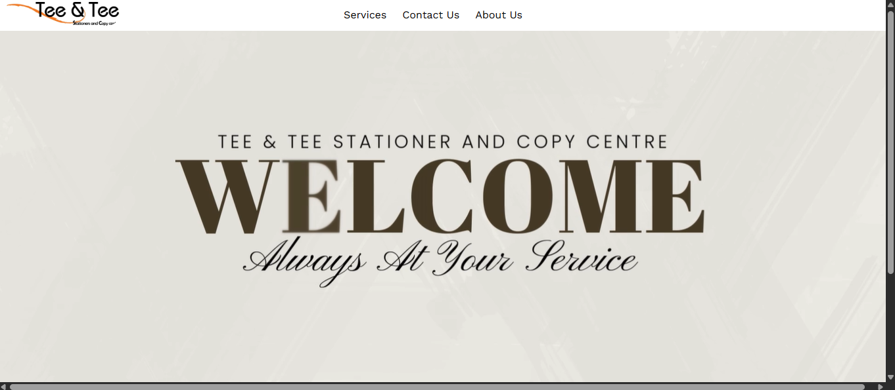
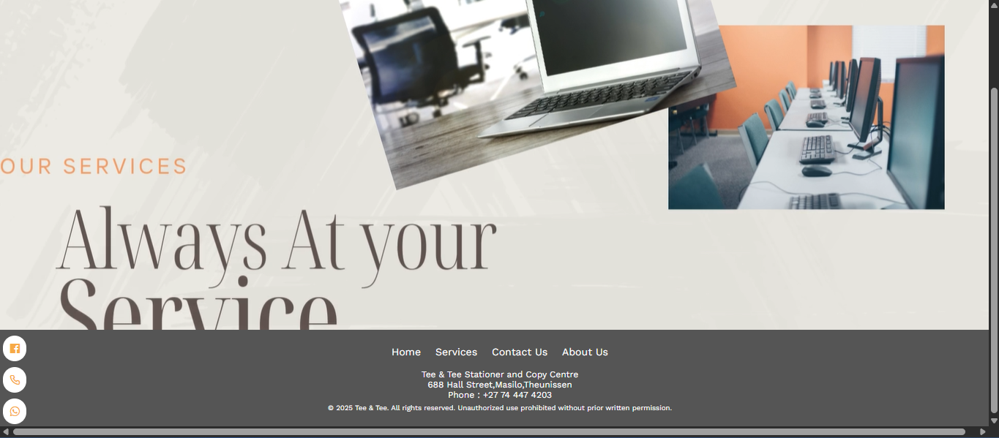
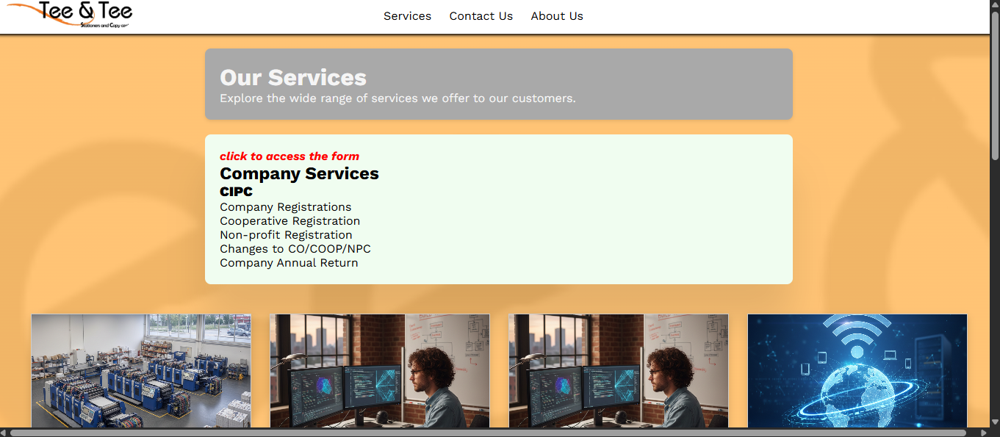
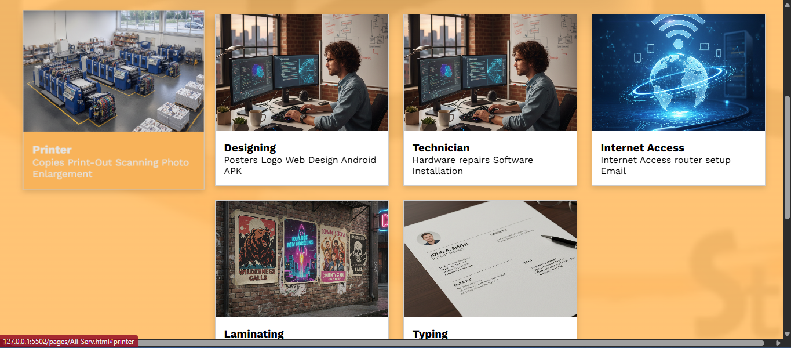
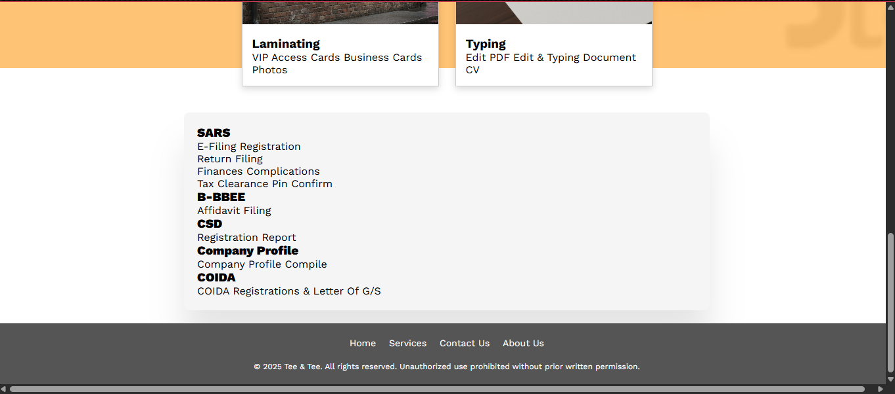
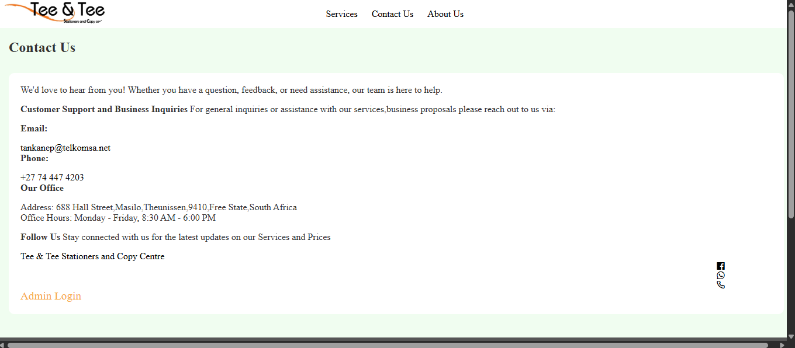

# Tee & Tee Stationery and Copy Centre Website

> A real-world web development project created for **Tee & Tee Stationery and Copy Centre**, designed to establish a professional online presence and provide customers with accessible information about the business and its services.

## 📌 Project Overview

The Tee & Tee Stationery and Copy Centre Website is a web-based application developed as a practical software development project.

The project focuses on designing and developing a professional, user-friendly website that represents the business online and provides customers with information about its services.

The website is currently **under active development**, with additional features, improvements, and refinements planned for future releases.

## 🎯 Project Objectives

The main objectives of the project are to:

* Develop a professional online presence for Tee & Tee Stationery and Copy Centre.
* Present the company's services in an organized and accessible manner.
* Create a user-friendly interface for customers.
* Apply practical web development skills to a real-world business requirement.
* Develop a responsive experience for different screen sizes.
* Establish a foundation for future digital services and functionality.

## ✨ Current Features

The project includes or is being developed with features such as:

* 🏠 Home page
* ℹ️ About/business information
* 🛠️ Services section
* 🖼️ Business imagery and multimedia
* 📱 Responsive web design
* 📞 Customer contact information
* 🌐 Business-focused website structure
* 🔧 Ongoing UI and functionality improvements

## 🛠️ Technologies & Tools

### Frontend

* HTML5
* CSS3
* JavaScript

### Backend

* PHP
* MySQL

### Development Tools

* Visual Studio Code
* XAMPP
* Git
* GitHub

## 🏗️ Development Environment

The project is currently developed and tested locally using **XAMPP**.

The project is placed inside the XAMPP web server directory:

```text
C:\xampp\htdocs\Tee n Tee
```

The local development environment allows the website to be tested through an Apache/PHP server and, where applicable, a MySQL database.

## 📸 Website Preview








## 📂 Project Structure

The project follows a web application structure containing resources such as:

```text
Tee n Tee/
│
├── HTML/PHP pages
├── CSS/
├── JavaScript/
├── Images/
├── Media/
├── Database resources
└── README.md
```

The exact structure may evolve as development continues.

## 🚀 Getting Started

### Prerequisites

To run the project locally, install:

* XAMPP
* A modern web browser
* Visual Studio Code or another code editor
* Git (optional, for version control)

### Installation

1. Clone the repository:

```bash
git clone https://github.com/PaballoPitso/Website-T-T.git
```

2. Move the project into the XAMPP `htdocs` directory:

```text
C:\xampp\htdocs\
```

3. Start **Apache** in XAMPP.

4. Start **MySQL** if the current version of the project requires database functionality.

5. Open the website through:

```text
http://localhost/Tee%20n%20Tee/
```

> The local URL may change depending on the project's final folder structure and configuration.

## 🔐 Security

Sensitive information should never be committed to this repository.

This includes:

* Passwords
* API keys
* Database credentials
* Personal identification documents
* Private configuration files
* Other confidential information

A `.gitignore` file should be maintained as the project develops to prevent sensitive or unnecessary files from being committed.

## 📈 Future Development

Planned improvements include:

* Completing remaining website functionality
* Improving responsive design
* Enhancing the user interface
* Improving website accessibility
* Optimizing website performance
* Expanding service information
* Improving contact functionality
* Strengthening database integration where required
* Testing across different browsers and devices
* Deploying the completed website online

## 💡 Skills Demonstrated

This project provides practical experience in:

* Web development
* Frontend development
* Backend development
* PHP development
* Database integration
* Responsive design
* UI/UX improvement
* Troubleshooting
* Local server configuration
* Git version control
* GitHub repository management
* Real-world client/business requirements

## 👨‍💻 Developer

**Paballo Pitso**

Diploma in Information Technology

This project demonstrates my practical application of information technology and web development skills through the development of a real-world business website.

## 📊 Project Status

**🚧 In Development**

The project is actively being developed. The repository represents the current development version and will continue to receive improvements and new functionality.

## 📄 License

This project is intended primarily as a portfolio and business website project.

Copyright © Tee & Tee Stationery and Copy Centre.
